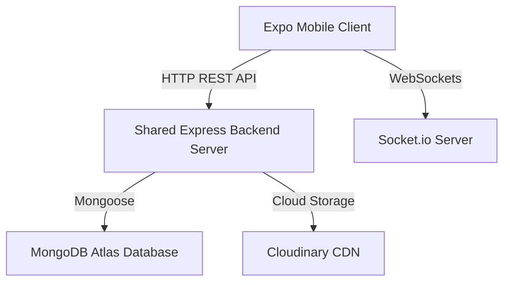

# 🚀 ElevateX Mobile

<p align="center">
  
</p>

<p align="center">
  <b>A High-Performance Gamified Momentum Network & Developer Community Client</b>
</p>

<p align="center">
  
  
  
  
</p>

---

## 📖 Overview

ElevateX is a next-generation platform for developers and creators to track their momentum, showcase their wins, collaborate on tasks, compete in XP-based duels, and connect in real-time. 

This repository contains the **cross-platform Expo mobile client** for ElevateX, designed with a premium dark glassmorphism aesthetic, responsive native haptics, and instant server updates. The app is fully linked with the shared backend server and MongoDB database, offering a unified user experience across web and mobile.

---

## ✨ Features

### 🔐 Authentication & Session Security
* **Google Sign-In**: Native Google OAuth integration for quick and secure registration/sign-in.
* **Guest Sessions**: Allows instant anonymous access with unique generated user IDs (`guest_xxxx`) and full session persistence.
* **Secure Storage**: JWT access tokens are stored securely using Expo `SecureStore`.

### 💬 Instagram-Style Real-time Chat
* **Follow-Only Messaging**: A premium messaging policy restricts DMs to people you follow, preventing spam.
* **Typing Indicators & Read Receipts**: WhatsApp-style double-tick delivery indicators and live typing feedback using Socket.io.
* **Rich Uploads**: Media picker supports photo and video uploads (up to 200MB) with an inline progress loader.
* **Message Reactions**: Tap and react to messages with an emoji reactions overlay.

### 📰 Dynamic Feed & Suggested Discoveries
* **Feed Sorting Filters**: Quickly toggle the feed between **Latest** (newest updates), **Trending** (sorted by engagement: likes + comments), and **Following** (posts from developers you follow).
* **Suggested for You Carousel**: A premium horizontal card slider featuring trending posts from developers in the community, providing an interactive discovery experience.
* **Developer Muting**: A persistent user mute system filtered through Zustand and `AsyncStorage` to hide posts/suggestions from muted users.

### 🎮 Gamification & Achievements
* **XP Tracking & Levels**: Accumulate XP by completing tasks, unlocking achievements, and participating in challenges.
* **Alchemy Lab**: Unlock interactive badges, achievements, and track progression milestones.
* **Streaks**: Maintain daily activity to grow your consecutive day streak.
* **Global Leaderboards**: Rank dynamically by XP or Level across seasons.

### 💼 Live Gig & Task Market
* **Task Management**: Browse, assign, track, and complete developer opportunities.
* **Reward Distribution**: Earn coins and XP upon task completion and verification.

---

## 🛠 Tech Stack

* **Framework**: React Native + Expo SDK 52 (Expo Router)
* **Design System**: Dark Glassmorphism, HSL tail-colors, custom Haptics
* **Server State**: `@tanstack/react-query`
* **Local State**: Zustand + Persist Middleware (`AsyncStorage`)
* **Real-time Sync**: `socket.io-client`
* **Media Management**: `expo-image-picker` + `expo-document-picker`

---

## 📁 Architecture Overview



### Key Modules:
* **`apps/mobile/app/`**: File-based routes using Expo Router.
* **`apps/mobile/components/`**: Reusable premium UI components (cards, headers, avatars, inputs).
* **`apps/mobile/stores/`**: Local state management (authentication, theme, saved posts, muted users).
* **`apps/mobile/lib/`**: Custom APIs, media upload handlers, typography definitions.

---

## 🚀 Getting Started

### Prerequisites
* [Node.js](https://nodejs.org/) & [Bun](https://bun.sh/)
* [Expo Go](https://expo.dev/client) app installed on your physical device, or an iOS Simulator / Android Emulator.

### Installation

1. Clone the repository and navigate to the project directory:
   ```bash
   git clone https://github.com/vivaswanshetty/ElevateX-Mobile.git
   cd ElevateX-Mobile
   ```

2. Install dependencies using Bun:
   ```bash
   bun install
   ```

3. Configure your local environment variables in `apps/mobile/.env`:
   ```env
   EXPO_PUBLIC_API_URL=http://<YOUR_LOCAL_IP>:5001
   EXPO_PUBLIC_GOOGLE_WEB_CLIENT_ID=<YOUR_GOOGLE_CLIENT_ID>
   ```

---

## 💻 Development Commands

From the workspace root, run the following commands:

| Action | Command | Description |
|:---|:---|:---|
| **Start All** | `bun run dev:all` | Launches the local backend server (port 5001) and Expo dev client concurrently. |
| **Mobile Client** | `bun run dev:mobile` | Starts the Expo development server only. |
| **Backend Server** | `bun run dev:backend` | Starts the backend server only. |
| **Android Run** | `bun run dev:android` | Spawns the backend and boots up the Android Emulator. |
| **Type Check** | `bun run typecheck:mobile` | Runs strict TypeScript compiler checks on the mobile app. |

---

## 📦 Cloud Builds (EAS)

ElevateX uses Expo Application Services (EAS) for remote cloud build generation.

To start an internal Android APK build, run the following command inside `apps/mobile/`:
```bash
eas build --platform android --profile internal
```

---

## 🎨 Design Guidelines & Aesthetics

* **Glassmorphism**: Translucent panels use fine borders (`rgba(255, 255, 255, 0.15)`) and dark card backgrounds (`rgba(255, 255, 255, 0.03)`) for depth.
* **Micro-interactions**: Uses custom `HapticPressable` elements to provide satisfying haptic feedback on taps, selections, and button transitions.
* **Responsive Tab Bar**: The custom floating bottom navigation bar automatically hides when the system keyboard is active, keeping inputs fully unobstructed.
